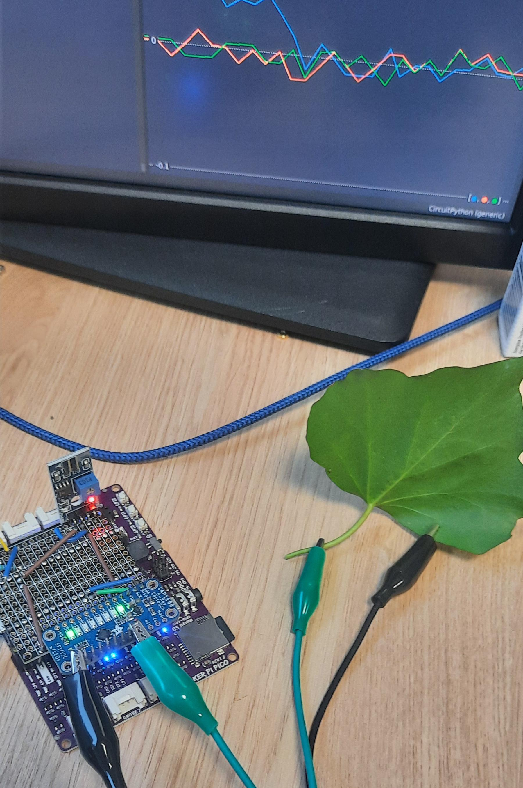

# PlantListener
Repo for development of a board that listens to the bioelectricity of plants and logs this data. The aim of this porject is to investigate how bioelectricity can change given different stimuli to a plant. 

## Build
You will need a device capable of running CircuiPython. We have used the Raspberry Pi Pico flashed with <a href="https://circuitpython.org/board/raspberry_pi_pico/">circuitpython</a>. We simplified the sd card and audio output by using a <a href="https://thepihut.com/products/maker-pi-pico-base-without-pico">cytron data logger board</a>. 
We make use ot teh CAP118 breakout sensor from Adafruit to provide the capacitive touch.

Further sensors such as humidity, temperature, moister can be added alongside a PCB. 



## Installation
To install this on a device you need to make sure you have a circuitpython device with the Adafruit CAP1188 library and Adafruit Onewire library both installed. Use GPIO9 for SCL pin and GPIO8 for SDA pin. 
Copy the code <a href="code/listerner.py">listerner.py</a> to the CP board. 

In another file we can import the listerner:

```
from listerner import *

l=listerner()
values=l.step() #reads all sensors and returns an array of size 8
```


### Filtering
Use the ```listerner.filter(values)``` function to apply a bandpass filter over each electrode. 
The filter applies as following:

$B_i = \frac{RC}{RC + \Delta_T} B_{i-1} + \frac{RC}{RC + \Delta_T}(y_i-y_{(i-1)})$

$RC = \Delta_T \frac{\alpha}{1-\alpha}$